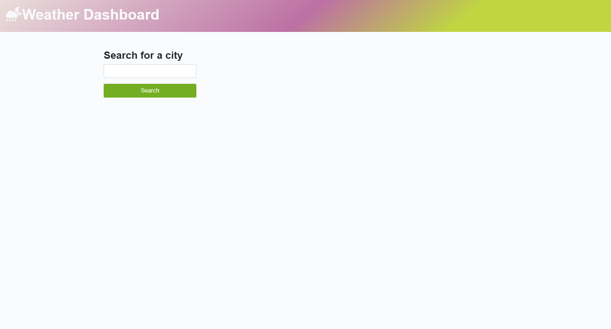
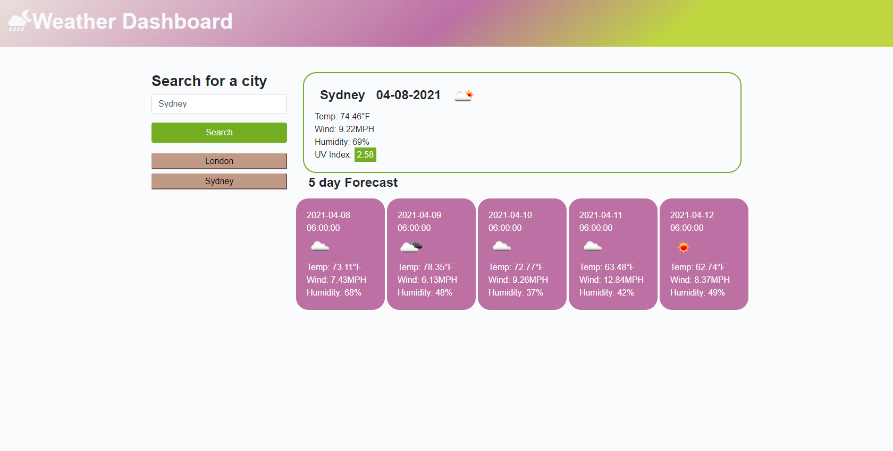

# Server Side API's: Weather Dashboard

- This project is a weather dashboard to view weather condition according to city.
- This project uses OpenWeather One Call API to retrieve weather data for cities.
- When a user searches for a city name, then it gives the current weather followed by 5-day forecast.
- It displays temperature, wind and humidity and icon representation of weather conditions.
- It also displays the current UV index.
- The searched city is also stored in local storage so a search history can be maintained. When clicking on the stored city name, again current and future temperature is displayed.

## Mock up

- The following image shows the web application's appearance
  

- The following image shows the result section when a city is entered.

## Link to deployed application

## Techonology used

HTML, CSS, Bootstrap, Server Side API, jQuery, localStorage

https://sona29.github.io/weatherdashboard/
